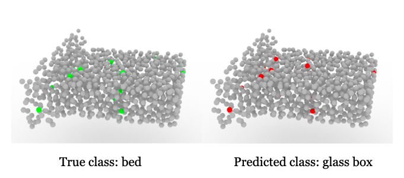

# Minimal Adversarial Examples for Deep Learning on 3D Point Clouds(ICCV 2021)

<a href="https://ja-yeon-kim.github.io/minimun_point_atack.github.io/"></a>
<a href="https://openaccess.thecvf.com/content/ICCV2021/papers/Kim_Minimal_Adversarial_Examples_for_Deep_Learning_on_3D_Point_Clouds_ICCV_2021_paper.pdf"></a>

This repository contains a tensorflow implementation of the paper:

[Minimal Adversarial Examples for Deep Learning on 3D Point Clouds](https://ja-yeon-kim.github.io/minimun_point_atack.github.io/)
<br>
[Jaeyeon Kim](jkimbi@connect.ust.hk), 
[Binh-Son Hua](https://sonhua.github.io/),
[Duc Thanh Nguyen](https://ducthanhnguyen.weebly.com/),
[Sai-Kit Yeung](https://www.saikit.org/index.html)<br>
Hong Kong University of Science and Technology, VinAI Research, Deakin University

>**Abstract:**
With recent developments of convolutional neural networks, deep learning for 3D point clouds has shown significant progress in various 3D scene understanding tasks, e.g., object recognition, semantic segmentation. In a safetycritical environment, it is however not well understood how such deep learning models are vulnerable to adversarial examples. In this work, we explore adversarial attacks for point cloud-based neural networks. We propose a unified formulation for adversarial point cloud generation that can generalise two different attack strategies. Our method generates adversarial examples by attacking the classification ability of point cloud-based networks while considering the perceptibility of the examples and ensuring the minimal level of point manipulations. Experimental results show that our method achieves the state-of-the-art performance with higher than 89% and 90% of attack success rate on synthetic and real-world data respectively, while manipulating only about 4% of the total points.



```bibtex
@InProceedings{Kim_2021_ICCV,
    author    = {Kim, Jaeyeon and Hua, Binh-Son and Nguyen, Thanh and Yeung, Sai-Kit},
    title     = {Minimal Adversarial Examples for Deep Learning on 3D Point Clouds},
    booktitle = {Proceedings of the IEEE/CVF International Conference on Computer Vision (ICCV)},
    month     = {October},
    year      = {2021},
    pages     = {7797-7806}
}
```
**Please CITE** our paper whenever our model implementation is used to help produce published results or incorporated into other software.

## Getting Started

The codebase is tested on
- Ubuntu
- CUDA 10.0, CuDNN 7

### Installation
- Clone this repo:
``` 
git clone https://github.com/ja-yeon-kim/Minimal_point_attack.git
cd Minimal_point_attack
```

- Install dependencies:
```
conda create -n Minimum_point_attack python=3.7
conda activate Minimum_point_attack
conda install -c anaconda tensorflow-gpu=1.14
```

```
# for distance code, set the cuda path and run:
bash ./utils/tf_nndistance_compile.sh
```

### Datasets

- **Cad dataset**: we use cad dataset with 40 categories from [Modelnet40](https://modelnet.cs.princeton.edu/)
- **Scan dataset**: we use real scan dataset with 15 categories from [ScanObjectNN](https://github.com/hkust-vgd/scanobjectnn)
If you need to try with your own dataset, you need to make txt, h5 file and label txt file.

### Pre-trained models
Run the below command to train <a href="https://github.com/charlesq34/pointnet" target="_blank">Pointnet </a>
```
python ./pointnet/train.py
```
For your reference, the pretrained model is available from <a href="https://drive.google.com/drive/folders/1gBPch5vFqBqyvb9LVcdXvaQV_0P5u1Fs?usp=sharing" target="_blank">here</a><br>
And please refer the different model codes from [Pointnet++](https://github.com/charlesq34/pointnet2), [DGCNN](https://github.com/WangYueFt/dgcnn), [SpiderCNN](https://github.com/xyf513/SpiderCNN), [PointASNL](https://github.com/yanx27/PointASNL).

### Attack
To run the attack, set the data, ckpt path and run:
```
python main.py
```
The descriptions of the arguments are shown below.
| **Args** | **Descriptions** |
| :------- | :---------- |
| `dataset_type` | Choose the dataset {`scanobnn`, `modelnet40`} |
| `attack_type` | Choose the dataset {`perturbation`, `addition`} |
| `h_dist_weight` | lambda for distance loss, default is 50 |
| `class_loss_weight` | lambda for classification loss, default is 1 |
| `count_weight` | lambda for minimum loss, default is 0.15 |

The attack code is in `attack.py`

### Visualize
We provide visual code.<br>
you can use `visualize.py` with Jupyter Interactive Window.<br>
The sample point clouds are in `test_sample folder`.

### Acknowledgments
Our source code is devleoped based on the codebase of great attack papers: [3D Point Cloud Adversarial Attacks and Defenses](https://github.com/Daniel-Liu-c0deb0t/3D-Neural-Network-Adversarial-Attacks), [Generating 3D Adversarial Point Clouds](https://github.com/xiangchong1/3d-adv-pc). 

We also specifically thank to [Pointnet](https://github.com/charlesq34/pointnet), [Pointnet++](https://github.com/charlesq34/pointnet2), [DGCNN](https://github.com/WangYueFt/dgcnn), [SpiderCNN](https://github.com/xyf513/SpiderCNN), [PointASNL](https://github.com/yanx27/PointASNL),  [Adversarial point perturbations on 3D objects](https://github.com/Daniel-Liu-c0deb0t/Adversarial-point-perturbations-on-3D-objects), [PointCloud Saliency Maps](https://github.com/tianzheng4/PointCloud-Saliency-Map), [Robust Adversarial Objects against Deep Learning Models](https://github.com/jinyier/ai_pointnet_attack), [ScanObjectNN](https://github.com/hkust-vgd/scanobjectnn), [Modelnet40](https://modelnet.cs.princeton.edu/).

Overall, thank you so much to the authors for their great works and efforts to release source code and pre-trained weights.

## Contacts
If you have any questions, please drop an email to _jaeyeon.kim@connect.ust.hk_ or open an issue in this repository.
